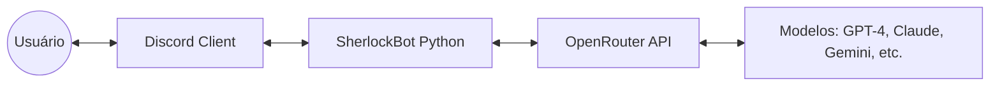
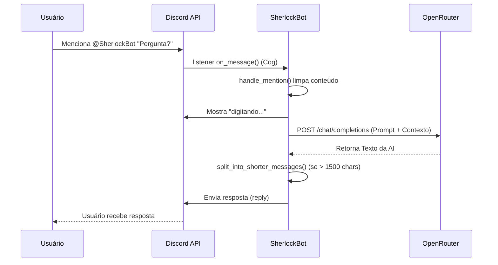

# Arquitetura do Sistema - SherlockBot

Este documento descreve a arquitetura técnica do SherlockBot, um assistente jurídico para Discord
integrado ao OpenRouter.

## 1. Visão Geral de Alto Nível

O SherlockBot é um chatbot assíncrono construído em Python. Ele atua como uma ponte entre a
interface do usuário (Discord) e provedores de Inteligência Artificial (via OpenRouter).

## 2. Interações de Componentes

O sistema é modularizado para separar responsabilidades:

- **`main.py`**: Entry point com `commands.Bot`. Carrega cogs no `setup_hook`, sincroniza comandos
  e inicializa exemplos de conversa.
- **`cogs/chat.py`**: Slash command `/chat` e listeners de mensagens (menções e threads).
- **`completion.py`**: Interface com a API de IA. Encapsula a lógica de chamada ao OpenRouter usando
  o SDK da OpenAI de forma assíncrona.
- **`base.py`**: Define as estruturas de dados fundamentais (`Message`, `Conversation`,
  `ThreadConfig`) garantindo consistência entre os módulos.
- **`constants.py`**: Ponto central de configuração. Carrega variáveis de ambiente, define modelos
  disponíveis e parâmetros globais.
- **`utils.py`**: Fornece funções auxiliares para manipulação de mensagens (divisão de texto > 2000
  caracteres) e gerenciamento de threads.
- **`moderation.py`**: Módulo para filtragem de conteúdo (atualmente delegando a segurança para os
  filtros nativos dos modelos do OpenRouter).

## 3. Diagramas de Fluxo de Dados

### Fluxo de uma Pergunta via Menção (@SherlockBot)

## 4. Decisões de Design e Justificativa

- **Uso de Threads do Discord**: Optou-se por criar threads para cada conversa iniciada pelo
  `/chat`. Isso mantém o canal limpo e permite que o bot use o histórico da thread como memória de
  curto prazo (contexto).
- **Integração OpenRouter**: Em vez de se prender a um único provedor (OpenAI), o uso do OpenRouter
  permite alternar entre modelos (GPT, Claude, Gemini, Llama) apenas alterando uma variável de
  ambiente ou parâmetro de comando.
- **Processamento Assíncrono (`asyncio`)**: Crucial para que o bot não trave enquanto aguarda a
  resposta da API de IA, permitindo atender múltiplos usuários simultaneamente.
- **Divisão de Mensagens**: O Discord tem um limite rígido de 2000 caracteres por mensagem. A
  arquitetura implementa uma divisão inteligente (`split_into_shorter_messages`) para garantir que
  respostas longas sejam entregues integralmente.

## 5. Restrições e Limitações

- **Latência**: Depende da velocidade do modelo selecionado no OpenRouter e da rede. Modelos "free"
  ou muito grandes podem levar alguns segundos.
- **Memória de Contexto**: Limitada pelo `max_tokens` e pelo tamanho da janela de contexto do modelo
  escolhido. Threads muito longas podem exceder esses limites (o bot fecha a thread automaticamente
  quando o limite de mensagens é atingido).
- **Rate Limits**: O bot está sujeito aos limites de taxa da API de IA (OpenRouter) e da API do
  Discord.
- **Moderação**: A filtragem automática baseada em API está desabilitada para reduzir latência e
  custos, confiando na segurança embutida dos modelos e nas regras do servidor Discord.
